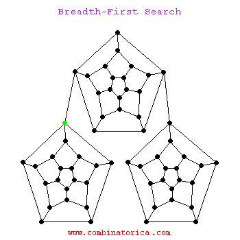

## Graph

<!-- @import "[TOC]" {cmd="toc" depthFrom=1 depthTo=6 orderedList=false} -->

<!-- code_chunk_output -->

-   [Graph](#graph)
    		_ [Representation of graph](#representation-of-graph)
    			_ [有向图](#有向图)
    				_ [拓扑排序](#拓扑排序)
    		_ [DFS](#dfs)
    			_ [模版](#模版)
    		_ [BFS](#bfs)
    			_ [模板](#模板)
    		_ [extension](#extension)

<!-- /code_chunk_output -->

### Representation of graph

[representing-graphs](https://www.khanacademy.org/computing/computer-science/algorithms/graph-representation/a/representing-graphs)

-   Edge lists
-   Adjacency matrices（(i,j)为1表示i与j之间有连接）
-   Adjacency lists(i->j,k,l 有三条边由i指向j,k,l)

图一般是带环的，没有环的一般称之为树。图还分为**有向图**和**无向图**。

#### 有向图

-   **有向图**的边有方向，若一条边由顶点u指向顶点v，则可以表示(u,v)。
-   有n条边指向顶点v，就可以说顶点v的**indegree**为n。
-   有向图一定有环，但是若几条边的方向首尾相连，那么就会构成一个**圈**。圈上的顶点的indegree都大于0.

##### 拓扑排序

[拓扑排序](http://blog.csdn.net/changyuanchn/article/details/17067349)是对有向无圈图的顶点的一种排序，这个排序的结果是如果存在一条vi到vj的路径，那么排序中vi在vj的前面。

    a) 查找indegree为0的点p
    b) 对所有与p邻接的点的indegree = indegree -1；
    c) 查找indegree为0的点（p除外），然后循环过程

这里只是一种拓扑排序的一种方法。

-   207 Course Schedule
-   210 Course Schedule II

### DFS

-   一根筋走到底
-   需要用hash表或者stack来保存已经访问过的结点
-   [演示过程](http://www.cs.usfca.edu/~galles/visualization/DFS.html)

<!--  -->


#### 模版

```python
def DFS(graph, start):
    # 1.terminator
    if start is None:
        return []
    # 2.init container
    visited = []
    stack = [(start)]

    while stack:
        # 3.pop one node from container
        node  = stack.pop()
        visited.add(node)
        # 4.process current node
        process(node)
        # 5.push releated nodes to container
        nodes = generate_related_nodes(node)
        stack.push(nodes)

    #other processing work
    ...
```

-   DFS可以用递归，如果不用递归，则用stack来维护

-   时间复杂度为O(N)，每个结点只访问一次

递归做法

-   22 Generate Parentheses
-   37 Sudoku Solver
-   51 N-Queens
-   79 Word Search
-   200 Number of Islands
-   102 Binary Tree Level Order Traversal
-   112 Path Sum(适合一头扎到底)
-   113 Path Sum II
-   124 Binary Tree Maximum Path Sum
-   515 Find Largest Value in Each Tree Row

* * *

### BFS

-   [演示过程](http://www.cs.usfca.edu/~galles/visualization/BFS.html)
    <!--  -->
    

#### 模板

```python
def BFS(graph, start):
    # 1.terminator
    if start is None:
        return []
    # 2.init container
    visited = []
    queue.append([start])

    while queue:
        # 3.pop one node from container
        node = queue.pop()
        visited.add(node)
        # 4.process current node
        process(node)
        # 5.push releated nodes to container
        nodes = generate_related_nodes(node)
        queue.push(nodes)

    # other processing work
    ...
```

-   BFS不能用递归，因为递归是往下深入一层，与BFS的语义就违背了。所以BFS只能用队列来维护。
-   time:O(N)

-   对于树的BFS和DFS，不需要判重，因为树没有环。

在求两个点之间的最短路径，用BFS更好（01-matrix）
从一个字符串转换到另一个字符串，也是这类问题（word search）
bfs像水波纹一样扩散出去，这样一层层扩展出去，找到路径时一定是**最短**的路径（word search II）。而dfs要全部遍历完之后才能比较是否是最简单的路径。
**dfs适合求满足一定条件的路径**，dfs不适合解最优性的问题。
<!-- -   22 Generate Parentheses -->
-   102 Binary Tree Level Order Traversal
-   103 Binary Tree Zigzag Level Order Traversal  
-   515 Find Largest Value in Each Tree Row
-   542 01 Matrix(好题目)
-   433 minimum genetic mutation
-   127 word ladder

### extension

DFS用stack
BFS用queue
如果用priority_queue,就是A\*算法，启发式搜索
