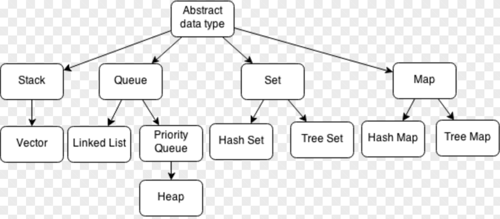

# Basic Data Structure Operations

-   [Basic Data Structure Operations](#basic-data-structure-operations)
    -   [vector](#vector)
    -   [linked-list](#linked-list)
    -   [priority_queue](#priorityqueue)


常用的数据结构一般有数组、单链表、栈、队列、树、哈希表、图等。这是按照数据结构的定义来划分的，一般关于数据结构的书上都是这么划分的。但是实际应用中，例如STL中封装的数据结构种类远不止这么多，而它们的底层实现却无外乎上述几种结构。这里按照STL中的结构将抽象数据结构分为stack、queue、set和map四种结构。

-   stack和queue都可以分别基于数组和链表实现。但实际应用中，stack常用于一些特殊模式的存储，和数组一样，按照先后顺序存储元素即可，对数据结构本身并没有太多操作，所以这里将其归为一类。
-   linked-list（**单链表**）在实际应用中主要用于那些插入删除频繁的数据结构，考察点也主要是单链表的基本操作。由于单链表不能随机访问，只能按照插入顺序逐个访问元素，这个过程就类似于队列的特性。此外链表还有 **双向链表** 和 **环形链表** ，但是在实际应用中最常用的还是单链表。**vector、linked-list、stack和queue都属于线性结构，应用中常用的线性结构还有双端队列deque。**
-   priority-queue能够按照特定的要求输出元素（按大小顺序等），其内部除了存储元素之外，还要维护一些额外的信息来实现该功能，一般由堆（也即树）或者其他更加复杂的结构来来实现。**所以priority-queue的内部其实是非线性结构，但是对使用者来说，可以像它的名字一样，把它看作是一个队列。**
-   set和map常用于查询某个数据是否存在，如果追求查询效率，则用哈希表来存储，查询时间复杂度为O(1)；而用红黑树来存储，查询复杂度为O(log n)，但是内部元素是排好序的，可以整体按序输出。

其实从内存的角度来看，所有的数据结构都可以归为链表，这里的链表并不等同于单链表。数据结构的形式变化再大，在内存中的每个结点无外乎要存储当前结点的值和后续结点的位置指针这两种元素。而每一种数据结构都可以看作是链表的一种特例，数组可以看作是以连续位置代替位置指针；后续指针为一个时就是单链表，为多个时就是树；后续指针又再次指向前序结点时就构成了图；而以数组和单链表为基础又可以根据不同功能来构建栈、队列与哈希表等结构。所以当你能够从一个计算机的角度来看待时，你就能够认识到这些数据结构都是统一的。

* * *

## vector

**41.first missing positive**

-   哈希表查找

solution 1
该题的一般解法是先对数组进行排序，再从正整数部分开始遍历，查找到第一个不连续的值就可以。时间复杂度为O(nlogn)，主要是排序的时间复杂度。

solution 2
第二种方法就根据题目的特性，数组中有n个元素，最理想的情况就是n个元素都是连续正整数，这样输出n，否则的话输出的数会小于n（考虑有负数和大的不连续的数的情况）。所以该方法首先将数组中的元素都存入哈希表，然后遍历数字1~n，查询当前数字是否在哈希表中，如不存在，则输出当前数；若都存在，则输出n。

**k sum**

-   两边夹逼
    时间复杂度最低为O(n^(k-1))
    空间复杂度最低为O(1)

solution 1
k层循环逐个数遍历 O(n^k)

solution 2
1\.  数组元素存入哈希表
2\.  k-1层遍历，k-1个数加起来作为当前target
3\.  从哈希表查询target是否存在

time: O(n^(k-1))
space: O(n)

solution3

k>=3时 
1\.  先sort数组 O(nlogn)
2\.  k-2层循环枚举，k-2个数加起来作为当前target
3\.  剩下n-k+1个元素两边夹逼，两个指针首尾遍历O(n)

time:O(n^(k-1))
space:O(1)

**k=2时就退化为solution 2**

**20.valid parentheses**

-   stack应用

## linked-list

**21.Recover Binary Search Tree**

* * *

## priority_queue

[priority_queue](https://en.wikipedia.org/wiki/Priority_queue)可以有多种实现方式，内部结构不同，其操作的时间复杂度也不同。


最简单的方式就基于堆来实现。**这里的时间复杂度记最优的情况就可以。** 
优先队列有以下一些应用：

-   Bandwidth management
-   Discrete event simulation
-   Dijkstra's algorithm
-   Huffman coding
-   Best-first search algorithms ( like A\* )
-   Prim's algorithm for minimum spanning tree
-   ROAM triangulation algorithm

* * *

**239.sliding window maximum**

**480.sliding window median**

solution 1
基本方法：两层循环 O(n\*k)

solution 2
通用方法
1\.  最外层循环 O(n)
2\.  用priority queue来维护这个window，最优情况下存取复杂度都为O(1)，但是不是最优时可能会退化为O(log n)
3\.  每次priority queue输出最大值即可

**此方法的通用性在于priority queue的强大，可以适用于各种情况。比如求最大值，最小值，或者中值，或者第k大的数，都可以用priority queue来实现**

solution 3 特殊方法
deque
1\.  最外层循环 O(n)
2\.  用deque来维护这个window，deque中存储元素下标，这里deque的大小不固定，不像priority queue一样固定为k

```cpp
← deque  →
[1  3  -1] -3  5  3  6  7
↑       ↑
front   back

//1.窗口移动时，弹出最左边元素（如果该元素仍在窗口有效范围内，则保留）
if(deque.front <= i-k)       deque.pop_front();
//2.从窗口右端开始逐个与当前数nums[i]比较，小于nums[i]的数都弹出队列
while(nums[deque.back] < nums[i])     deque.pop_back();
//3.nums[i]插入队列，这样可以保证deque中的数是按照从大到小排列
//每次遍历nums[i]时，队列中比它小的数都会被删除
//这样队首总是窗口内的最大值
deque.push_back(i);
//4.输出最大值
res.push_back(nums[deque.front()]);
```

time: O(n)

**变形：求窗口中的中值**
由于这里是求中值，所以不能够直接用dequeue来求解。这里就体现出使用priority_queue的强大。

solution 1
依然用priority_queue来维护窗口，每次吐出k/2个元素，就可以得到中值。或者用c++11中的next算法，可以直接得到priority_queue中的第k/2个元素。

```cpp
auto it = std::next(window.begin(), (k - 1) / 2);
```

对于vector这种类型，next的时间复杂度为O(1)，而这里的时间复杂度为O(k)。

solution 2
用一个大顶堆和一个小顶堆来实现求中值。窗口内小于中值的数，存入大顶堆中，大于中值的数，存入大顶堆中。
1\. remove element，每次窗口移动时，窗口最左边的数从包含它的堆中去除。
2\. add element，窗口最右端新的数插入堆中。如果该数大于minHeap（大于中值的数）的root，则插入minHeap；否则插入maxHeap。（一开始可以默认加入maxHeap）
3\. adjust heap，调整minHeap与maxHeap，使它们的大小之差&lt;=1。大于1时就把堆顶元素吐给另一个堆
4\. get median，取中值，只需要两个堆的root求平均，或者直接去元素多的那个堆的root即可。

这样求中值的时间复杂度为O(1)。

其他应用：
**23.Merge k Sorted Lists**


## skip list
todo
可以实现范围查询？
## hash table
todo 主要是概念