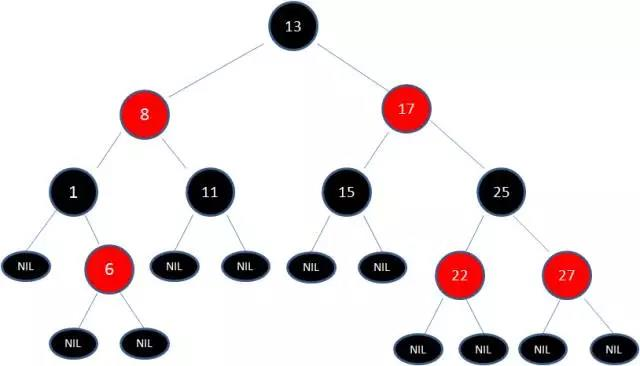

## Tree

-   [Tree](#tree)
    -   [Binary Search Tree](#binary-search-tree)
        -   [Basics](#basics)
            -   [判断是否为BST](#%E5%88%A4%E6%96%AD%E6%98%AF%E5%90%A6%E4%B8%BAbst)
            -   [BST ←→ Array/Linked list](#bst-%E2%86%90%E2%86%92-arraylinked-list)
        -   [Query/Insert/Delete/Balance](#queryinsertdeletebalance)
            -   [查找](#%E6%9F%A5%E6%89%BE)
            -   [插入与删除](#%E6%8F%92%E5%85%A5%E4%B8%8E%E5%88%A0%E9%99%A4)
            -   [平衡](#%E5%B9%B3%E8%A1%A1)
        -   [PreOrder/InOrder/PostOrder Traversal](#preorderinorderpostorder-traversal)
        -   [BFS/DFS](#bfsdfs)
    -   [Heap](#heap)
        -   [Insert](#insert)
        -   [Delete](#delete)

### Binary Search Tree

二叉搜索树是一种常用的用来存储和查找数据的树形结构， **它在二维的结构中巧妙地将元素的大小关系也保留下来** 。符合如下特征：
1. 若任意节点的 **左子树** 不空， 则 **左子树** 上所有结点的值均小于它的根结点的值；
2. 若任意节点的 **右子树** 不空， 则 **右子树** 上所有结点的值均大于它的根结点的值；
3. 任意节点的左、 右子树也分别为二叉查找树；
4. 没有键值相等的结点。

特别要注意的是这里判别标准是 **左右子树** 而不是左右结点，并且空树也可以看作是二叉搜索树。二叉查找树相比于其他数据结构的优势在于查找、插入的时间复杂度较低，为O(log n) **这里n为树的高度** 。一些常用的抽象数据结构，例如set、map等，都是基于二叉搜索树实现，并且一些高级的搜索树，例如红黑树，AVL树，其本质都是二叉搜索树。

二叉搜索树的操作主要有以下几种：

-   元素的查找、插入与删除（包括插入与删除后的平衡） 
-   前序、中序与后序遍历
-   广度优先遍历与深度优先遍历

单独考察树的知识时，基本着重于树的种类的判别（是否是BST、平衡树等），上述的几种操作，及其相应概念与方法的一些变体（计算深度、结点等）。而树作为工具使用时，常用于数据的查询，多用set和map。

```cpp
//Definition for a binary tree node.
struct TreeNode {
    int val;
    TreeNode *left;
    TreeNode *right;
    TreeNode(int x) : val(x), left(NULL), right(NULL) {}
};
```

#### Basics

##### 判断是否为BST

###### recursion

这一类方法一般用递归的方法根据定义来判断。而递归的实现可以分为三步：
1. recursion terminator
2. current level processing
3. drill down
4. reverse the current level status if needed

按照这个固定的模式可以轻松地写出递归程序，有时其中第二和第三步会混在一起或者交换顺序，待具体情况而定。而第四步也要依据具体情况来看是否需要，比如BFS、DFS中就可能需要。

-   226.Invert Binary Tree 将二叉树镜像翻转

```cpp
    TreeNode *invertTree(TreeNode *root)
    {
        //recursion terminator
        if (root == NULL)
        {
            return NULL;
        }

        //current level processing
        std::swap(root->left, root->right);

        //drill down
        invertTree(root->left);
        invertTree(root->right);

        return root;
    }
```

递归在BST中的其他应用

-   98 Validate Binary Search Tree
-   101 Symmetric Tree
-   104 Maximum Depth of Binary Tree
-   111 Minimum Depth of Binary Tree
-   235 Lowest Common Ancestor of a Binary Search Tree
-   236 Lowest Common Ancestor of a Binary Tree  

###### divide and conquer

当然，这类问题也是可以用更一般的分而治之（divide and conquer）法来处理。上述递归法只是分治的一种特例形式，其更一般的形式为：
1. recursion terminator
2. prepare data (将数据分给每一个子问题)
3. conquer subproblems (分给每一个子问题去处理) 
4. process and gererate the final result (将每一个子问题的答案汇总处理，并返回)

对于树的话一般就是分为左子树和右子树去处理。

-   111 Minimum Depth of Binary Tree

```cpp
int minDepth(TreeNode *root)
{
    //1.recursion terminator
    if (root == NULL)
    {
        return 0;
    }
    //2.prepare data + 3.conquer subproblems
    int l_depth, r_depth;
    if (!root->left)
    {
        r_depth = minDepth(root->right);
        return 1 + r_depth;
    }
    if (!root->right)
    {
        l_depth = minDepth(root->left);
        return 1 + l_depth;
    }
    l_depth = minDepth(root->left);
    r_depth = minDepth(root->right);
    //4.process and gererate the final result
    return std::min(l_depth, r_depth) + 1;
}
```

##### BST ←→ Array/Linked list

有序数组、链表转为BST，其一般方法和过程如下图所示，不断的寻找中点，作为当前子树的root结点，然后递归下去。对于链表，可以用快慢指针来寻找中点。
另一种方法是采用中序遍历的方法，因为BST的中序遍历结果就是有序的数组或者链表，而将有序数组、链表转为BST，则是其逆命题。


-   109 Convert Sorted List to Binary Search Tree

而将BST转为有序数组，如上所述，采用中序遍历的方法就可以实现目标。


-   114 Flatten Binary Tree to Linked List   

#### Query/Insert/Delete/Balance

##### 查找

在二叉搜索树b中查找某个元素x的过程为：

-   若b是空树，则搜索失败，否则：
-   若x等于b的根节点的数据域之值，则查找成功；否则：
-   若x小于b的根节点的数据域之值，则搜索左子树；否则：
-   查找右子树。


二叉搜索树的查找过程十分类似于二分查找法，但其优势是二叉搜索树按照中序遍历可以直接输出有序的元素。

##### 插入与删除

二叉搜索树的插入与删除都是基于查找来实现的，超找到对应的位置，再进行操作。以向二叉搜索树b中插入结点s为例，其过程为

-   若b是空树，则将s所指结点作为根节点插入，否则：
-   若s->data等于b的根节点的数据域之值，则返回，否则：
-   若s->data小于b的根节点的数据域之值，则把s所指节点插入到左子树中，否则：
-   把s所指节点插入到右子树中。（新插入节点总是叶子节点）


二叉搜索树的查找复杂度是与树的高度成比例，但是其在插入或者删除的过程中，可能退化为一个单链表，这时候的查找效率就会大打折扣。所以平衡的作用就是通过变换树的结点的位置，来让所有结点在根节点的两边平均分布，以降低树的高度，达到提高查找效率的目的。

##### 平衡

todo

#### PreOrder/InOrder/PostOrder Traversal

二叉搜索树的三种[遍历方法](https://www.tutorialspoint.com/data_structures_algorithms/tree_traversal.htm)实现形式非常类似，只是处理当前阶段的顺序在前、中、后的差别。具体形式如下：

```cpp
PreOrder(TreeNode *root){
    if(root){
        traverse_path(root);
        PreOrder(root->left);
        PreOrder(root->right);
    }
}

InOrder(TreeNode *root){
    if(root){
        InOrder(root->left);
        traverse_path(root);
        InOrder(root->right);
    }
}

PostOrder(TreeNode *root){
    if(root){
        PostOrder(root->left);
        PostOrder(root->right);
        traverse_path(root);
    }
}
```

对于三种遍历方法的实现，这里都可以用递归的方法来实现，而且推荐使用递归的形式来实现。为什么呢？很多人和教材以及网上的资料会告诉你递归要不断进行上下文切换与堆栈的调用，效率低下。但是实际情况中，未必是这样。用STL的栈和队列结构来手动实现递归同样也有会引入很多其他的开销，例如额外变量的创建、拷贝等。而且很多时候STL的操作代码看似很简洁，但是内部却做了很多的事，并且很多人对这些内部处理的开销知之甚少。同时不同应用场景下，影响一个程序效率的因素太多，太多是我们无法掌控的，既然无法掌控，就不能妄加评论说是效率低。

但是我可以肯定的是，大部分情况下，手动实现递归的代码可读性会比递归实现的代码差，这就给维护人员造成很大麻烦，甚至几个月后自己看都看不懂。要记住代码是写给人看的，给计算机运行只是一个额外的功能。你的代码只要能跑起来或者编译通过，那就说明计算机能够理解，这并不难，但要让别人也能一下看懂你的代码，这就很难了。在现在互联网应用的快读开发中，你的代码不可能写完后就永远不改了，实际情况是要经常改动，甚至要由别人来维护。如果你的代码写的简单、清晰明了，让人能很快理解，这让才便于维护，也能更好地重构。从产品角度来讲，这是降低了人月成本，也是提高了效率。

那么BST的递归操作时间复杂度是多少呢？这里的一个方法就是看每个结点访问了几次，这三种遍历方法对每个结点来说都只访问一次，所以时间复杂度都是O(N)，这里N是BST结点的数目。很多递归算法在每一层展开计算时，会有很多重复计算的结点，所以造成时间复杂度呈现指数。最典型的就是裴波那契问题，但是BST的递归每一层其实都是按照树的结构展开的，而BST中的结点又是不交叉重复的，所以不用担心时间复杂度指数增长。

从以上几点来讲，实际开发中，涉及到BST的一些操作，用递归来实现完全就可以。一般来说性能的瓶颈并不在这（这里特指BST的递归）。这里的应用场景是指需要通过裸操作来实现对数据的处理，所以数据量不会很大。对于复杂的或是海量数据，那就建议用专门的框架、库来操作，而且这些库一般都会提供封装好的接口来操作。

**应用**
preorder

-   114 Flatten Binary Tree to Linked List

inorder

-   99 Recover Binary Search Tree

* * *

### Heap

这里的堆并不是指内存中的堆栈，而是指大顶堆与小顶堆这样的结构，其本质上也是一颗 **二叉平衡树**。其顶点值为树中的最大值或者最小值。但是值得注意的是，**堆除了顶点为最大值之外，内部子树并不能保证像二叉搜索树那样有序，但是每棵子树的顶点都是该子树的最大值**。

#### Insert

堆在插入新元素时总是在堆的**末尾**插入。那么堆的末尾是什么位置？就是按从左到右依次在各叶子结点后插入，这样能保证左右子树的高度最多相差1（平衡）。之后还需要调整各个结点的值，以使整个树达到平衡。
1. 比较新结点与父结点的值，如果大于父结点的值，则与父结点交换（交换两个结点的值）。
2. 若小于等于父结点的值，则停止。
3. 再次比较交换后的结点与其父结点的值，重复1、2的过程，直到当前节点小于等于父结点的值。


#### Delete

**堆只能删除堆顶元素，而不能直接删除中间的某个元素。** 删除堆顶元素后，要对堆进行重新调整，使得堆顶仍为最大值或者最小值。

1.  将堆尾结点移到堆顶。
2.  比较堆顶结点和它的左右子节点。
3.  如果堆顶元素小于某个子结点，那么和值较小的结点进行交换。
4.  如果堆顶元素大于两个子节点，那么停止。
5.  交换后的子树重复2~4的过程，直到停止或者自身变为叶子结点。


### RB Tree

**红黑树的本质是BST**，但是通过定义一系列的特性以及平衡操作，**使整个树的高度降低**，这样查找效率就能提高！红黑树具有如下的一些特征：

1.  节点是红色或黑色。
2.  根节点是黑色。
3.  每个叶子节点都是黑色的空节点（NIL节点）。
    4   每个红色节点的两个子节点都是黑色。(从每个叶子到根的所有路径上不能有两个连续的红色节点)
4.  从任一节点到其每个叶子的所有路径都包含相同数目的黑色节点。  
      
    红黑树从根到叶子结点的最长路径不会超过最短路径的两倍。  

红黑树的应用比较广泛，主要是用它来存储有序的数据，它的时间复杂度是O(lgn)，效率非常之高。
例如，Java集合中的TreeSet和TreeMap，C++ STL中的set、map，以及Linux虚拟内存的管理，都是通过红黑树去实现的。
#### Balancing

红黑树在插入或者删除结点时如果破坏了规则，那么就必须重新调整，以符合红黑树的规则。调整的方法有变色和旋转两种。

##### 变色

下图是红黑树的一部分，插入21结点后
